# Simon DataLab Infrastructure - Complete System Architecture

Based on analysis of <http://simondatalab.de/> and the Learning Management System Academy codebase.

## 🏗️ Complete System Architecture (Mermaid.js)

```mermaid
graph TB
    %% External Layer
    subgraph "🌐 External Access"
        Internet[Internet Users]
        CloudFlare[☁️ Cloudflare DNS<br/>DNS-only mode<br/>API Management]
        LetsEncrypt[🔒 Let's Encrypt<br/>Auto SSL Renewal<br/>Multi-domain SAN]
    end

    %% Public Infrastructure
    subgraph "🏢 Hetzner Infrastructure"
        ProxmoxHost[🖥️ Proxmox VE Host<br/>136.243.155.166:2222<br/>6.8.12-14-pve]
        
        subgraph "🔒 SSL Termination & Reverse Proxy"
            NginxProxy[⚡ Nginx Reverse Proxy<br/>SSL Termination<br/>Load Balancing]
            SSLCerts[📜 SSL Certificates<br/>/etc/letsencrypt/live/ollama.simondatalab.de/<br/>8 Domains SAN]
        end
        
        subgraph "🛡️ Network Security"
            IPTables[🔥 IPTables NAT/Firewall<br/>Port Management<br/>Security Rules]
            NetworkBridge[🌉 Network Bridges<br/>vmbr0: 136.243.155.166/26<br/>vmbr1: 10.0.0.0/24]
        end
    end

    %% Internal Network Layer
    subgraph "🏠 Internal Network (10.0.0.0/24)"
        
        %% Container 150 - Portfolio
        subgraph "📦 Container 150 (10.0.0.150)"
            Portfolio[🎨 Portfolio Website<br/>simondatalab.de<br/>Neural GeoServer Viz<br/>3D Animations]
            PortfolioNginx[⚡ Nginx Web Server<br/>Portfolio Assets<br/>Geospatial Viz]
        end

        %% VM 9001 - Moodle & Analytics
        subgraph "🖥️ VM 9001 (10.0.0.104) - Learning Platform"
            
            subgraph "🎓 Moodle LMS Stack"
                Moodle[📚 Moodle LMS<br/>Bitnami 4.3.2<br/>Python Academy<br/>Port 8086]
                MoodleDB[🗄️ MariaDB 11.1.2<br/>Learning Data<br/>User Management]
                MoodleTheme[🎨 Epic Course Theme<br/>Interactive JS<br/>Custom CSS]
            end

            subgraph "🔬 ML & Analytics Platform"
                JupyterHub[📊 JupyterHub<br/>Data Science Notebooks<br/>Port 8000]
                MLflow[🤖 MLflow<br/>ML Experiment Tracking<br/>Model Registry<br/>Port 5000]
                MLAPI[🚀 ML API<br/>Model Serving<br/>Prediction Endpoints<br/>Port 8001]
                BitBucket[📂 BitBucket<br/>Code Repository<br/>Port 7990]
            end

            subgraph "📈 Monitoring Stack"
                Grafana[📊 Grafana Dashboard<br/>Metrics Visualization<br/>Alerting]
                PrometheusVM[📈 Prometheus<br/>Metrics Collection<br/>Time Series DB]
                NodeExporter[📡 Node Exporter<br/>System Metrics]
                PostgresExporter[📊 Postgres Exporter<br/>Database Metrics]
                BlackboxExporter[🔍 Blackbox Exporter<br/>Endpoint Monitoring]
                AlertManager[🚨 AlertManager<br/>Alert Routing<br/>Notifications]
                CAdvisor[🐳 cAdvisor<br/>Container Metrics]
            end
        end

        %% VM 159 - AI Services
        subgraph "🖥️ VM 159 (10.0.0.110) - AI Platform"
            Ollama[🧠 Ollama<br/>LLM Inference<br/>AI Chat Services]
            MLflowAI[🤖 MLflow Instance<br/>AI Model Registry<br/>Experiment Tracking]
            AINodeExporter[📡 Node Exporter<br/>AI System Metrics]
            AICAdvisor[🐳 cAdvisor<br/>AI Container Metrics]
        end

        %% VM 106 - GeoNeural Analytics
        subgraph "🖥️ VM 106 (10.0.0.106) - GeoNeural Lab"
            
            subgraph "🌍 Geospatial Platform"
                PostGIS[🗺️ PostGIS Database<br/>Spatial Analytics<br/>Geographic Data<br/>Port 5432]
                Redis[⚡ Redis Cache<br/>Session Storage<br/>Real-time Data<br/>Port 6379]
                GeoAPI[🌐 GeoNeural API<br/>Spatial Analytics<br/>Port 8088]
            end

            subgraph "📊 Analytics Services"
                MetricsProxy[📊 Metrics Proxy<br/>API Gateway<br/>CORS Handling<br/>Node.js]
            end
        end

        %% VM 200 - Media & Storage
        subgraph "🖥️ VM 200 (10.0.0.103) - Media Platform"
            NextCloud[☁️ NextCloud<br/>File Storage<br/>Collaboration<br/>Port 8088]
            Jellyfin[📺 Jellyfin Media<br/>Streaming Server<br/>Content Management<br/>Port 8096]
        end

        %% Global Monitoring
        subgraph "📊 Global Monitoring (Proxmox)"
            PrometheusHost[📈 Prometheus Master<br/>Central Metrics<br/>Port 9090]
            PVEExporter[📊 Proxmox VE Exporter<br/>Hypervisor Metrics<br/>Port 9221]
        end
    end

    %% Future/Work in Progress Layer
    subgraph "🚧 Future/Work in Progress"
        
        subgraph "🗺️ Advanced GeoServer Integration"
            GeoServer[🌍 GeoServer Enterprise<br/>WMS/WFS Services<br/>Map Publishing<br/>Spatial Data Processing]
            GeoWebUI[🖥️ GeoServer Web UI<br/>Layer Management<br/>Style Configuration]
        end

        subgraph "📊 Enhanced Analytics Pipeline"
            DataLake[🏞️ Data Lake<br/>Raw Data Storage<br/>Multi-format Support]
            StreamProcessing[⚡ Stream Processing<br/>Real-time Analytics<br/>Event Processing]
            DataWarehouse[🏢 Data Warehouse<br/>OLAP Analytics<br/>Historical Data]
        end

        subgraph "🤖 Advanced ML Operations"
            MLPipeline[🔄 ML Pipeline<br/>Automated Training<br/>Model Deployment]
            FeatureStore[🏪 Feature Store<br/>Feature Management<br/>ML Feature Serving]
            ModelServing[🚀 Model Serving<br/>Scalable Inference<br/>A/B Testing]
        end

        subgraph "🔐 Enhanced Security & Governance"
            VaultSecrets[🔒 HashiCorp Vault<br/>Secrets Management<br/>Certificate Rotation]
            DataGovernance[📋 Data Governance<br/>Lineage Tracking<br/>Compliance Monitoring]
            RBAC[👥 Role-Based Access<br/>User Management<br/>Permission Control]
        end
    end

    %% Data Flow Connections
    Internet --> CloudFlare
    CloudFlare --> ProxmoxHost
    LetsEncrypt --> SSLCerts
    
    ProxmoxHost --> NginxProxy
    NginxProxy --> SSLCerts
    ProxmoxHost --> IPTables
    ProxmoxHost --> NetworkBridge
    
    NginxProxy --> Portfolio
    NginxProxy --> Moodle
    NginxProxy --> Grafana
    NginxProxy --> Ollama
    NginxProxy --> MLflow
    NginxProxy --> NextCloud
    NginxProxy --> Jellyfin
    
    Portfolio --> PortfolioNginx
    
    Moodle --> MoodleDB
    Moodle --> MoodleTheme
    Moodle --> JupyterHub
    Moodle --> MLflow
    Moodle --> MLAPI
    
    JupyterHub --> MLflow
    MLAPI --> MLflow
    
    Grafana --> PrometheusVM
    PrometheusVM --> NodeExporter
    PrometheusVM --> PostgresExporter
    PrometheusVM --> BlackboxExporter
    PrometheusVM --> CAdvisor
    PrometheusVM --> AlertManager
    
    Ollama --> MLflowAI
    AINodeExporter --> PrometheusHost
    AICAdvisor --> PrometheusHost
    
    PostGIS --> Redis
    GeoAPI --> PostGIS
    GeoAPI --> Redis
    MetricsProxy --> GeoAPI
    
    PrometheusHost --> PVEExporter
    PrometheusHost --> NodeExporter
    PrometheusHost --> AINodeExporter
    
    %% Future Connections (Dotted)
    GeoAPI -.-> GeoServer
    PostGIS -.-> GeoServer
    GeoServer -.-> GeoWebUI
    
    MLflow -.-> MLPipeline
    MLflowAI -.-> MLPipeline
    MLPipeline -.-> FeatureStore
    MLPipeline -.-> ModelServing
    
    PostGIS -.-> DataLake
    Redis -.-> StreamProcessing
    StreamProcessing -.-> DataWarehouse
    
    ProxmoxHost -.-> VaultSecrets
    Moodle -.-> RBAC
    PostGIS -.-> DataGovernance

    %% Styling
    classDef external fill:#e1f5fe,stroke:#01579b,stroke-width:2px
    classDef infrastructure fill:#f3e5f5,stroke:#4a148c,stroke-width:2px
    classDef container fill:#e8f5e8,stroke:#1b5e20,stroke-width:2px
    classDef database fill:#fff3e0,stroke:#e65100,stroke-width:2px
    classDef monitoring fill:#fce4ec,stroke:#880e4f,stroke-width:2px
    classDef ai fill:#f1f8e9,stroke:#33691e,stroke-width:2px
    classDef future fill:#f5f5f5,stroke:#616161,stroke-width:2px,stroke-dasharray: 5 5
    
    class Internet,CloudFlare,LetsEncrypt external
    class ProxmoxHost,NginxProxy,IPTables,NetworkBridge,SSLCerts infrastructure
    class Portfolio,Moodle,JupyterHub,NextCloud,Jellyfin container
    class MoodleDB,PostGIS,Redis,DataLake,DataWarehouse database
    class Grafana,PrometheusVM,PrometheusHost,NodeExporter,PostgresExporter,BlackboxExporter,AlertManager,CAdvisor,PVEExporter,AINodeExporter,AICAdvisor,MetricsProxy monitoring
    class Ollama,MLflow,MLflowAI,MLAPI,MLPipeline,FeatureStore,ModelServing ai
    class GeoServer,GeoWebUI,StreamProcessing,VaultSecrets,DataGovernance,RBAC future
```



## 🎯 System Integration Overview

### Current Production Services

| Layer | Service | Domain | VM/Container | Purpose | Status |
|-------|---------|--------|--------------|---------|---------|
| **Frontend** | Portfolio | simondatalab.de | CT 150 | Personal Portfolio & 3D Viz | ✅ Active |
| **LMS** | Moodle | moodle.simondatalab.de | VM 9001 | Python Academy Learning | ✅ Active |
| **Analytics** | Grafana | grafana.simondatalab.de | VM 9001 | Monitoring Dashboard | ✅ Active |
| **AI/ML** | Ollama | ollama.simondatalab.de | VM 159 | LLM Inference | ⚠️ Backend Down |
| **ML Ops** | MLflow | mlflow.simondatalab.de | VM 159 | ML Experiment Tracking | ✅ Active |
| **Spatial** | GeoNeuralViz | geoneuralviz.simondatalab.de | CT 150 | Geospatial Analytics | ✅ Active |
| **Media** | Jellyfin | Direct Port 8096 | VM 200 | Media Streaming | ✅ Active |
| **Storage** | NextCloud | Port 8088 | VM 200 | File Management | ✅ Active |

### Key Integration Points

#### 1. **Moodle ↔ Analytics Pipeline**

- **JupyterHub**: Data science notebooks for course development
- **MLflow**: Track ML experiments and model performance
- **ML API**: Serve trained models for course recommendations
- **Grafana**: Monitor student engagement and system health

#### 2. **GeoNeural Lab ↔ Portfolio Integration**

- **PostGIS**: Store geospatial course data and student locations
- **Redis**: Cache real-time student activity and progress
- **Neural GeoServer Viz**: 3D visualization of learning analytics
- **Metrics API**: Feed live data to portfolio visualizations

#### 3. **Future GeoServer Integration**

- **WMS/WFS Services**: Serve geospatial course content
- **Layer Management**: Dynamic course material visualization
- **Spatial Analytics**: Geographic learning pattern analysis
- **Interactive Maps**: Course content delivery via geospatial interface

### Data Flow Architecture

#### Real-time Analytics Flow

```text
Student Activity (Moodle) → PostgreSQL → Redis Cache → GeoNeural API → Portfolio Visualization
```

#### ML Pipeline Flow

```text
Course Data (Moodle) → JupyterHub Analysis → MLflow Tracking → Model API → Personalized Learning
```

#### Monitoring Flow

```text
All Systems → Prometheus Collectors → Central Prometheus → Grafana Dashboards → Alert Manager
```

#### Future GeoServer Integration Flow

```text
Course Content → GeoServer → WMS Layers → Interactive Learning Maps → Student Engagement Analytics
```

## 🚀 Future Architecture Roadmap

### Phase 1: Enhanced Analytics (Q1 2026)

- Advanced student behavior analytics
- Predictive course completion models
- Real-time engagement scoring
- Automated content recommendations

### Phase 2: GeoServer Integration (Q2 2026)

- Full GeoServer deployment and configuration
- Spatial course content management
- Interactive geographic learning experiences
- Location-based learning analytics

### Phase 3: Advanced ML Operations (Q3 2026)

- Automated ML pipeline deployment
- Feature store implementation
- A/B testing framework for course content
- Advanced model serving infrastructure

### Phase 4: Enterprise Security & Governance (Q4 2026)

- HashiCorp Vault integration
- Advanced RBAC implementation
- Data lineage and governance framework
- Compliance automation and reporting

This architecture represents a comprehensive data intelligence platform that scales from individual learning to enterprise analytics, with geospatial capabilities and advanced ML operations integrated throughout the learning ecosystem.


## 🚀 Technology Stack & Expertise

<div align="center">

| 🧑‍💻 **Programming Languages** | ☁️ **Cloud & Infrastructure** | 🗄️ **Data Platforms** | 🤖 **ML & Analytics Frameworks** | 🛠️ **Data Engineering Tools** |
|:-----------------------------:|:----------------------------:|:---------------------:|:-------------------------------:|:-----------------------------:|
| Python (Expert)<br>SQL (Expert)<br>R<br>JavaScript<br>Bash<br>Scala | AWS<br>Azure<br>GCP<br>Docker<br>Kubernetes<br>Terraform<br>Ansible<br>GitLab CI/CD<br>GitHub Actions | PostgreSQL<br>MySQL<br>MongoDB<br>Redis<br>Elasticsearch<br>PostGIS<br>Snowflake<br>BigQuery | Pandas<br>NumPy<br>SciPy<br>scikit-learn<br>XGBoost<br>LightGBM<br>TensorFlow<br>PyTorch<br>Spark MLlib | Apache Airflow<br>Spark<br>Kafka<br>Flink<br>dbt<br>Great Expectations<br>MLflow<br>DVC |

</div>

### Highlights

- **Programming Languages:** Python & SQL for core analytics, R for statistics, JavaScript for web, Bash/Scala for automation and big data.
- **Cloud & Infrastructure:** Multi-cloud (AWS, Azure, GCP), containerization (Docker, Kubernetes), infrastructure-as-code (Terraform, Ansible), CI/CD automation.
- **Data Platforms:** Relational (PostgreSQL, MySQL), NoSQL (MongoDB), caching/search (Redis, Elasticsearch), spatial (PostGIS), cloud warehouses (Snowflake, BigQuery).
- **ML & Analytics Frameworks:** Full stack from Pandas/NumPy/SciPy to ML (scikit-learn, XGBoost, LightGBM), deep learning (TensorFlow, PyTorch), distributed ML (Spark MLlib).
- **Data Engineering Tools:** Orchestration (Airflow), streaming (Kafka, Flink), transformation/quality (dbt, Great Expectations), experiment tracking/versioning (MLflow, DVC).
